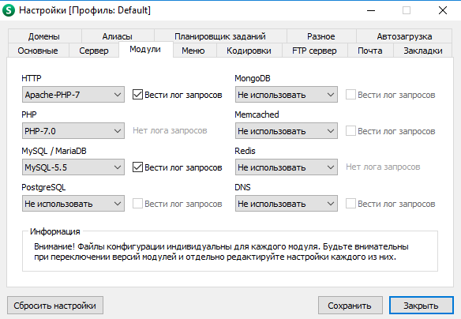
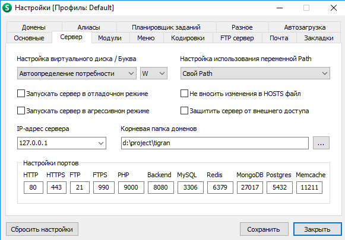
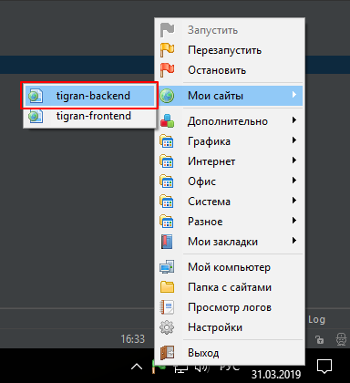

## Как установить new stage environment

###  Установка для WINDOWS ОС

#### 1. Установка PHP, MySQL (OpenServer).

- Скачать [OpenServer](https://ospanel.io/download/)

##### 1.1. Установите OpenServer 

- Распокуйте архив. 
- В папке `domain` создать директорию для сайта.

##### 1.2. Настройка сервера OpenServer 

##### 1.3. Создать базу данных

- в PhpMyAdmin создать базу данных с именнем `october`.

#### 2. Скачать OctoberCMS.

- Скачать [OctoberCMS](https://github.com/octobercms/october/releases) (версия не менее `v1.0.450`).
- Распоковать необходимые файлы для наблюдения в папку `domain`.

##### 2.1. Установите OctoberCMS 

- *Запустить OpenServer. В `Мои сайты` выберетие директорию в которой хранится OctoberCMS*

##### 2.2. Заменить файлы

- Скачать последние обновление проекта: `git clone git@bitbucket.org:tigran-shop/tigran-backend.git`.
- Заменить файлы.
- Удалить установочные файлы `install_files/` и `install.php`.

##### 2.3. Обновить базу данных

- в папке `database` лежит последняя версия базы данных, которую необходимо импортировать.